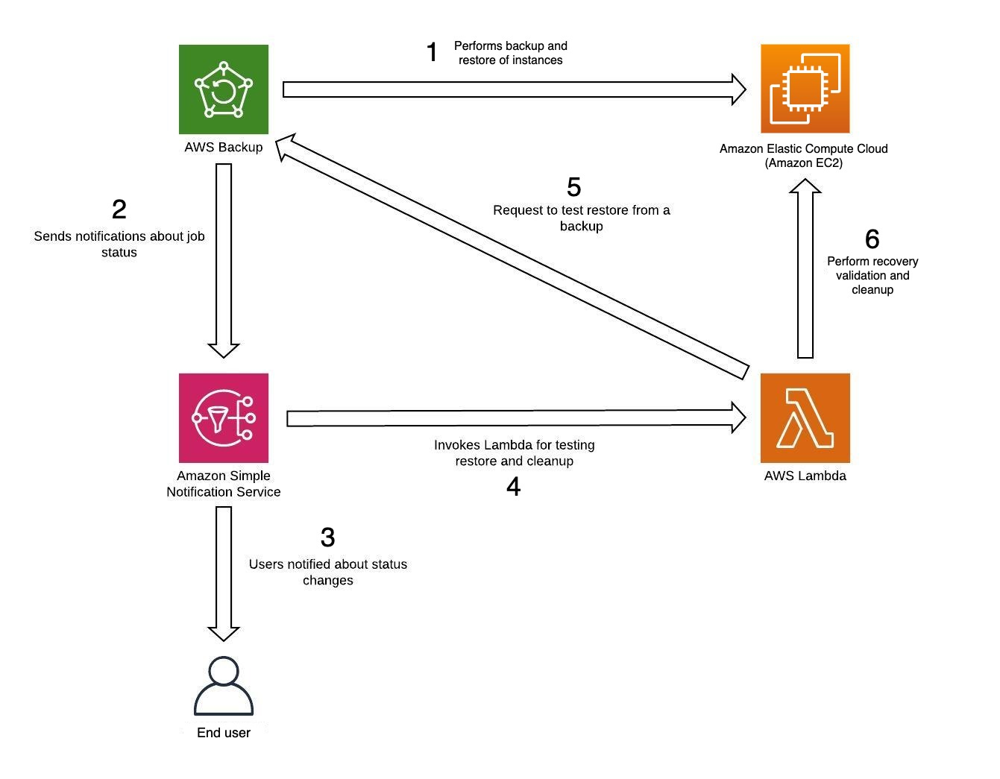

# AWS Backup Workshop

A comprehensive hands-on workshop for learning AWS Backup service through practical implementation and testing scenarios.

## 📋 Overview

This workshop provides a complete learning experience for AWS Backup, covering backup plan creation, automation, restoration testing, and notification setup. Participants will gain practical experience with AWS's managed data protection service while learning best practices for backup and recovery operations.

## 🎯 Learning Objectives

- **Backup Automation**: Create and configure AWS Backup plans for automated data protection
- **Multi-Service Support**: Implement backups for EBS Volumes, RDS Databases, DynamoDB Tables, and EFS File Systems
- **Recovery Testing**: Perform backup restoration operations to validate data integrity
- **Notification Systems**: Set up AWS SNS notifications for backup process monitoring
- **Best Practices**: Learn enterprise-grade backup and recovery strategies

## 🏗️ Architecture

The workshop implements a complete backup solution architecture featuring:

- **AWS Backup**: Centralized backup service for multiple AWS resources
- **AWS SNS**: Notification service for backup status alerts
- **Cross-service Integration**: Backup plans covering compute, database, and storage services
- **Automated Scheduling**: Policy-driven backup execution
- **Recovery Validation**: Systematic restore testing procedures



## 📚 Workshop Structure

### 1. Introduction
- AWS Backup service overview
- Data protection fundamentals
- Workshop objectives and architecture

### 2. Prerequisites
- Infrastructure deployment
- S3 bucket creation
- Required AWS resources setup

### 3. Backup Plan Creation
- Backup vault configuration
- Resource selection and tagging
- Schedule and lifecycle policies
- Cross-region backup setup

### 4. Notification Configuration
- SNS topic creation
- Backup job status notifications
- Email alert configuration
- Monitoring setup

### 5. Restore Testing
- Point-in-time recovery procedures
- Cross-region restore operations
- Data validation processes
- Recovery time testing

### 6. Resource Cleanup
- Backup deletion procedures
- Cost optimization practices
- Resource decommissioning

## 🛠️ Technical Stack

### Hugo Framework
- **Static Site Generator**: Hugo v0.80+
- **Theme**: hugo-theme-learn (workshop-optimized)
- **Content Format**: Markdown with front matter
- **Internationalization**: English and Vietnamese support

### AWS Services
- **AWS Backup**: Primary backup service
- **Amazon SNS**: Notification service
- **Amazon S3**: Backup storage destination
- **AWS IAM**: Access control and permissions
- **Amazon EBS**: Volume backup source
- **Amazon RDS**: Database backup source

### Development Tools
- **Content Management**: Markdown-based documentation
- **Asset Management**: Static images and resources
- **Responsive Design**: Mobile-friendly interface
- **Search Functionality**: Built-in content search

## 🚀 Quick Start

### Prerequisites
- Hugo v0.80 or higher
- Git for version control
- AWS CLI configured (for deployment)
- Basic understanding of AWS services

### Local Development

1. **Clone the repository**
   ```bash
   git clone <repository-url>
   cd 000013-AWSBackup
   ```

2. **Install dependencies**
   ```bash
   # Hugo theme is included as submodule
   git submodule update --init --recursive
   ```

3. **Start development server**
   ```bash
   hugo server -D
   ```

4. **Access the workshop**
   ```
   http://localhost:1313
   ```

### Production Build

```bash
# Generate static site
hugo --minify

# Output will be in ./public directory
```

## 📁 Project Structure

```
000013-AWSBackup/
├── config.toml              # Hugo configuration
├── content/                 # Workshop content
│   ├── _index.md           # Homepage
│   ├── 1-Introduce/        # Introduction section
│   ├── 2-Prerequiste/      # Prerequisites setup
│   ├── 3-Createbackupplan/ # Backup plan creation
│   ├── 4-EnableNoti/       # Notification setup
│   ├── 5-Testrestore/      # Restore testing
│   └── 6-Cleanup/          # Resource cleanup
├── static/                  # Static assets
│   ├── images/             # Workshop images
│   ├── css/                # Custom styles
│   └── AWS_Logo.svg        # AWS branding
├── themes/                  # Hugo themes
│   └── hugo-theme-learn/   # Workshop theme
├── layouts/                 # Custom layouts
│   ├── partials/           # Reusable components
│   └── shortcodes/         # Custom shortcodes
├── public/                  # Generated site (build output)
└── archetypes/             # Content templates
```

## 🌐 Deployment Options

### AWS Amplify
```bash
# Connect repository to AWS Amplify
# Build settings:
# - Build command: hugo --minify
# - Publish directory: public
```

### Amazon S3 + CloudFront
```bash
# Build and sync to S3
hugo --minify
aws s3 sync public/ s3://your-bucket-name --delete
```

### GitHub Pages
```bash
# Use GitHub Actions for automated deployment
# See .github/workflows/hugo.yml (if configured)
```

## 🔧 Configuration

### Hugo Configuration (config.toml)
- **Theme**: hugo-theme-learn with workshop variant
- **Languages**: English (primary) and Vietnamese
- **Features**: Search, breadcrumbs, navigation
- **Customization**: AWS branding and styling

### Content Management
- **Markdown**: Standard markdown with Hugo front matter
- **Images**: Optimized for web delivery
- **Internationalization**: Dual-language support
- **Navigation**: Hierarchical chapter structure

## 🎨 Customization

### Styling
- Custom CSS in `static/css/theme-workshop.css`
- AWS color scheme and branding
- Responsive design for all devices
- Print-friendly layouts

### Content
- Modular chapter structure
- Reusable shortcodes for common elements
- Image optimization and lazy loading
- Interactive elements and code blocks

## 📖 Content Guidelines

### Writing Standards
- Clear, concise technical writing
- Step-by-step instructions with screenshots
- Code examples with syntax highlighting
- Consistent formatting and structure

### Image Management
- High-quality screenshots and diagrams
- Consistent naming convention
- Optimized file sizes for web
- Alt text for accessibility

## 🤝 Contributing

### Content Updates
1. Fork the repository
2. Create feature branch
3. Update content in markdown format
4. Test locally with Hugo
5. Submit pull request

### Translation
- Vietnamese translations in `.vi.md` files
- Maintain content parity between languages
- Follow localization best practices

## 📄 License

This workshop content is provided for educational purposes. AWS service usage is subject to AWS terms and conditions.

## 🆘 Support

### Workshop Issues
- Check existing documentation
- Review AWS service limits
- Verify IAM permissions
- Consult AWS documentation

### Technical Support
- Hugo documentation: https://gohugo.io/documentation/
- AWS Backup documentation: https://docs.aws.amazon.com/aws-backup/
- Theme documentation: https://learn.netlify.app/

## 📊 Workshop Metrics

- **Duration**: 2-3 hours
- **Difficulty**: Intermediate
- **Prerequisites**: Basic AWS knowledge
- **Cost**: AWS Free Tier eligible (with limitations)

---

**AWS First Cloud Journey** | Building Cloud Skills Through Hands-On Learning
